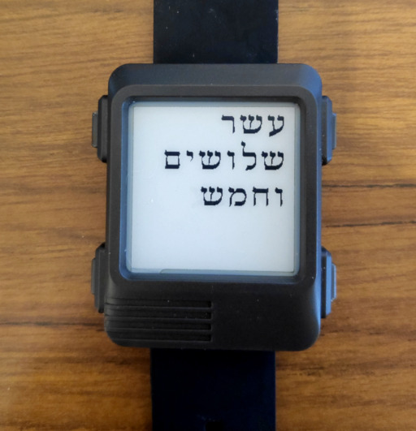

# Hebrew Text for Watchy
A bit hacky implementation of RTL Hebrew text watchface for [Watchy](https://watchy.sqfmi.com/).

New fonts can be created using `font-creator.html` - see the included assets 
and `HebSerif_Norm50pt7b` as example.

TODO
- 12 - hours clock
- More fonts
- Use unicode for the texts